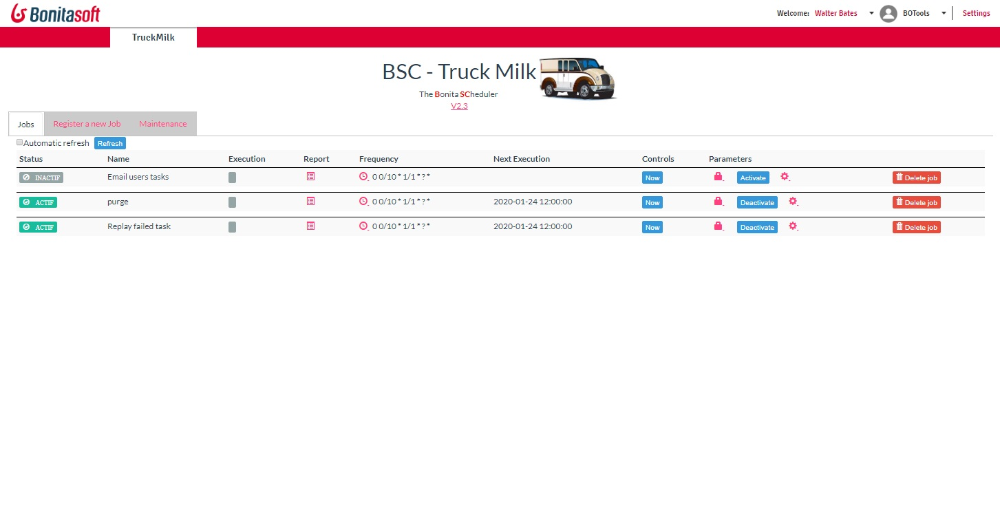

# page_truckmilk

Look the TruckMilk Manual.pdf guide to install the additionnal item

The Truck Milk page execute jobs at intervale (every minute/hour/day/weeks).

ATTENTION: see the Installation guide to install the page correctly (one component has to be copied on your server)

Access the documentation https://github.com/Bonitasoft-Community/page_truckmilk/blob/master/Truck...

# Different videos:

What is Truckmilk? [Introduction to Truckmilk](https://youtu.be/O6Ef7kEe0Ps)
Failed tasks: [Manage my failed tasks](https://youtu.be/-tRuEcUFcCE)
Schedule reminders on tasks: [Create a Reminder plan](https://youtu.be/8h3e_2jQg5M)
Do you want to develop your own Plugin? Visit [Develop and contribute !](https://youtu.be/bVE9HNK9Y4k)

